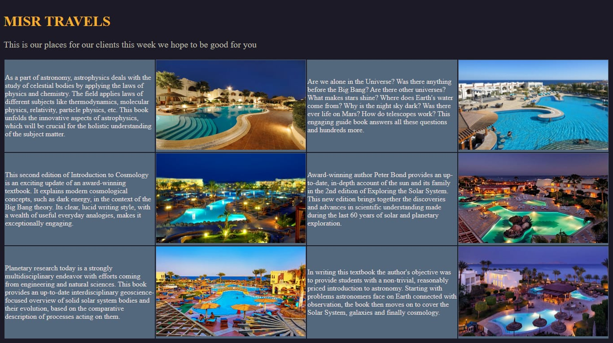
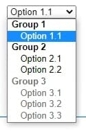
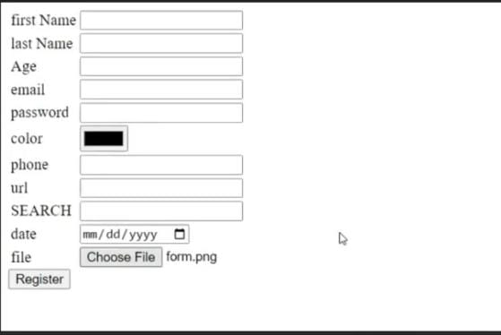

<table width="100%">
  <thead>
    <tr>
      <th>Session</th>
      <th>Day</th>
      <th>Reference</th>
      <th>Code</th>
      <th>Demo</th>
    </tr>
  </thead>
  <tbody>
    <tr>
      <td>Session1</td>
      <td>23/7/2026</td>
      <td></td>
      <td><a href="Task1/index.html">Link</a></td>
      <td><a href="https://djokerbat.github.io/Depi/Task1/index.html">Demo</a></td>
    </tr>
    <tr>
      <td rowspan="3">Session2</td>
      <td rowspan="3">27/7/2026</td>
      <td></td>
      <td><a href="Task2/task/index.html">Link</a></td>
      <td><a href="https://djokerbat.github.io/Depi/Task2/task/index.html">Demo</a></td>
    </tr>
       <tr>
      <td></td>
      <td><a href="Task2/task21/index.html">Link</a></td>
      <td><a href="https://djokerbat.github.io/Depi/Task2/task21/index.html">Demo</a></td>
    </tr>
       <tr>
      <td></td>
      <td><a href="Task2/task22/index.html">Link</a></td>
      <td><a href="https://djokerbat.github.io/Depi/Task2/task22/index.html">Demo</a></td>
    </tr>
    <tr>
      <td>Session3</td>
      <td>3/8/2026</td>
      <td></td>
      <td><a href="Task 3/index.html">Link</a></td>
      <td><a href="https://djokerbat.github.io/Depi/Task%203/index.html">Demo</a></td>
    </tr>
  </tbody>
</table>
